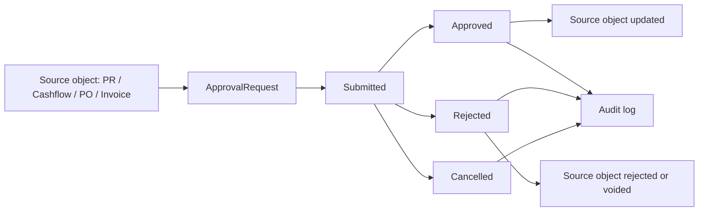

# Approval + Audit Core PRD

Status: Sprint 7 implemented on 2026-05-24

Implementation note 2026-05-24: document authority stamps are now modeled in `src/projectAccess.ts` and `supabase/migrations/0012_project_access_document_authority.sql`. BuildDocs prints prepared/submitted/checked/approved/issued stamps, gates authority/print/share/export actions with Admin Project Access grants, Projects now scopes read/write/admin actions through the same grant model, and Approval Center checks project permissions before approve/reject source updates and approved/void authority stamps.

## 1. Purpose

Build a generic Approval Center for money and control decisions before the app becomes a full ERP.

The goal is not a complex enterprise matrix yet. The first cut must make important actions visible, approvable, rejectable, and auditable.

## 2. Scope

- Generic `ApprovalRequest` domain service in `src/approvals.ts`
- Unified route `/approvals`
- Inbox for submitted PR and draft Cashflow entries
- Decision history for approved, rejected, and cancelled requests
- Audit write on every approval transition through `appendAuditEntry`
- Supabase relational schema in `supabase/migrations/0010_approval_requests.sql`

## 3. Non-Goals

- No multi-step approval matrix yet
- No external collaborator approval link yet
- No email/LINE notification yet
- No immutable ledger guarantees beyond local audit + future Supabase rows
- No full accounting posting

## 4. Data Model

Primary entity: `ApprovalRequest`

Key fields:

- `workspaceId`
- `targetType`: `pr`, `rfq_award`, `po`, `cashflow_entry`, `invoice`, `budget_override`
- `targetId`
- `sourceAppId`
- `projectId`, `costCodeId`, `supplierId`
- `amount`, `currency`
- `status`: `draft`, `submitted`, `approved`, `rejected`, `cancelled`
- `priority`: `normal`, `high`, `urgent`
- requester / approver fields
- `events[]`
- `metadata`

Every request is keyed by the business object. Example:

```text
approval-pr-{prId}
approval-cashflow-{entryId}
approval-po-{documentId}
```

## 5. Workflow



MVP behavior:

- PR `submitted` syncs into Approval Center.
- Approving a PR changes PR status to `approved`.
- Rejecting a PR changes PR status to `rejected` with reason.
- Cashflow `draft` syncs into Approval Center.
- Approving Cashflow changes entry status to `confirmed`.
- Rejecting Cashflow changes entry status to `void`.

## 6. UI

Route: `/approvals`

Tabs:

- `Inbox`: pending submitted approvals
- `History`: terminal decisions
- `Rules`: MVP rule explanation and next matrix direction

Expected controls:

- search
- target type filter
- approve / reject actions
- open source app
- manual sync

## 7. Audit

`applyApprovalAction()` writes to membership audit through `appendAuditEntry()` by default.

Audit action format:

```text
approval.submitted
approval.approved
approval.rejected
approval.cancelled
```

Payload includes:

- `approvalRequestId`
- `workspaceId`
- `projectId`
- `sourceAppId`
- `amount`
- `currency`
- `fromStatus`
- `toStatus`
- `reason`

## 8. Supabase

Migration: `supabase/migrations/0010_approval_requests.sql`

Tables:

- `approval_requests`
- `approval_events`

RLS:

- All reads/writes scoped by `is_workspace_member(workspace_id)`.
- Event access is inherited from parent approval request.

## 9. Acceptance

- `npm test -- --run src/approvals.test.ts` passes
- Full `npm test -- --run` passes
- `npm run build` passes
- `/approvals?tab=inbox&version=0.1` renders without framework overlay
- Approve/reject updates approval state and source PR/Cashflow state
- Audit log receives decision entries
- Project Access grants gate Approval Center approve/reject actions once at least one active grant exists; empty workspaces stay open for local-first onboarding

## 10. Next Iteration

- Configurable matrix: document type x amount x project x department x role
- Extend Project Access persistence into relational Supabase tables and future approval matrix conditions
- Attach RFQ award, PO, and Invoice source flows from their UI
- Add approval notifications
- Add read-only audit timeline in Approval Center row detail
