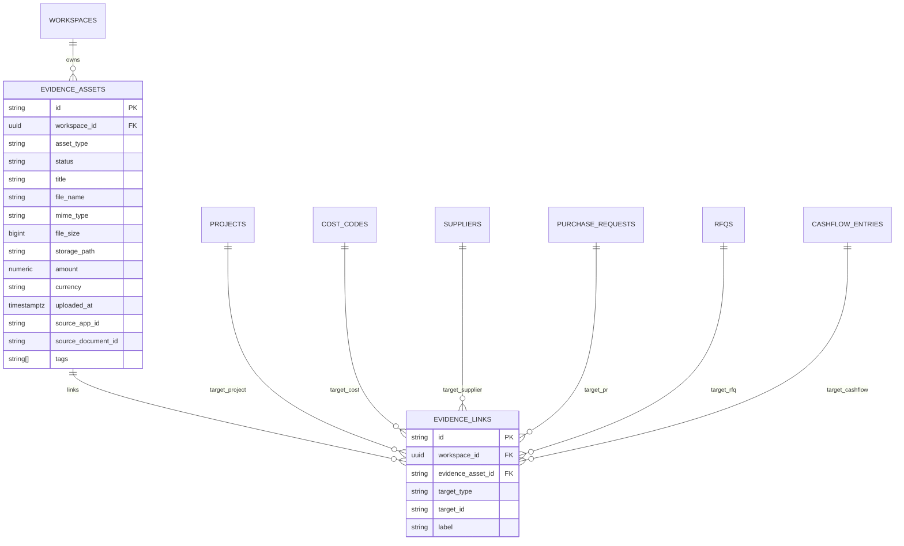

# Evidence Asset Layer PRD

Updated: 2026-05-24

Status: Sprint 8 implementation reference. Current implementation includes local-first data layer, workspace app UI, tests, Supabase migration `0011_evidence_assets.sql`, Defect Site Report location metadata, and Site Report location pin grouping.

## 1. Purpose

Evidence Asset Layer turns ERP numbers into auditable records. A project cost, RFQ award, cashflow entry, defect, invoice, or site report should be able to point to proof: receipt, photo, delivery note, RFQ quote, contract, or inspection file.

## 2. MVP Scope

Implemented now:

- Storage key: `evidence.assets.v1`
- Approval policy key: `evidence.approval-policy.v1`
- Data module: `src/evidence.ts`
- Workspace app: `/evidence?tab=library|intake|links|reports`
- Supabase tables: `evidence_assets`, `evidence_links`
- Local file intake using data URL for small files
- Status workflow: `draft -> verified | rejected -> archived`
- Links to project, cost code, supplier, PR, RFQ, cashflow, document, defect, approval
- Defect Site Report can add project-linked `site_360` and `site_file` evidence into the same Evidence layer
- Site Report location metadata is stored in EvidenceAsset `tags` as `site-floor`, `site-room`, `site-zone`, and `site-viewpoint`
- Site Report can group those tags into local Location pins for report/evidence filtering
- CSV export for filtered evidence rows
- Approval Center evidence gate: `off | warn | block`, configurable by minimum amount and target type
- RFQ award evidence gate: Procurement award flow now checks `evidence.approval-policy.v1` before final award

Not implemented yet:

- Supabase Storage bucket for binary files
- OCR/AI extraction from receipts
- automatic evidence creation from LINE/email intake
- immutable legal archive mode

## 3. Data Model

## 4. Asset Types

| Type | Use |
|---|---|
| `receipt` | payment slip, receipt, tax invoice receipt |
| `invoice` | invoice or billing document |
| `rfq_quote` | supplier quotation used for RFQ comparison |
| `delivery_note` | delivery note, material receiving proof |
| `site_photo` | site progress or condition photo |
| `site_360` | 360 walkthrough, site panorama, or external 360 viewer link |
| `site_file` | general site file, PDF report, video, or external proof link |
| `defect_photo` | before/after/checkpoint defect proof |
| `contract` | signed agreement, PO, contract proof |
| `other` | fallback |

## 5. Status Rules

| Status | Meaning |
|---|---|
| `draft` | uploaded or captured, not checked yet |
| `verified` | reviewed and accepted |
| `rejected` | reviewed but invalid or incomplete |
| `archived` | hidden from active review but kept for traceability |

Rules:

- New evidence starts as `draft`.
- `verified` records `verifiedAt` and `verifiedBy`.
- `rejected` must keep `rejectedReason`.
- Delete is available in local MVP; production should prefer archive or legal hold for financial evidence.

## 6. Link Rules

Evidence can link to multiple targets through `EvidenceLink`:

- `project`
- `cost_code`
- `supplier`
- `pr`
- `rfq`
- `cashflow_entry`
- `document`
- `defect`
- `approval`
- `other`

Use reference-by-convention for now because several source modules still use local string IDs and BuildDocs remains JSON-backed.

## 7. Acceptance Criteria

- `/evidence` route appears in workspace sidebar and app switcher.
- `src/evidence.ts` has normalized load/save/upsert/filter/status/link helpers.
- User can add file or metadata evidence from Intake tab.
- User can link evidence to project, cost code, supplier, PR, RFQ, and cashflow entry.
- User can verify, reject, archive, delete, open local preview, and export CSV.
- Unit tests cover storage, normalization, file intake, mutations, filtering, and summary.
- Supabase migration creates `evidence_assets` and `evidence_links` with RLS.

## 8. Next Steps

1. Add relational mapper from `evidence.assets.v1` to `evidence_assets` and `evidence_links`.
2. Add Supabase Storage bucket and replace cloud `dataUrl` with `storage_path`.
3. Add policy dimensions by project/app/role after RBAC is ready.
4. Add evidence auto-link helpers from RFQ response intake and uploaded supplier quotes.
