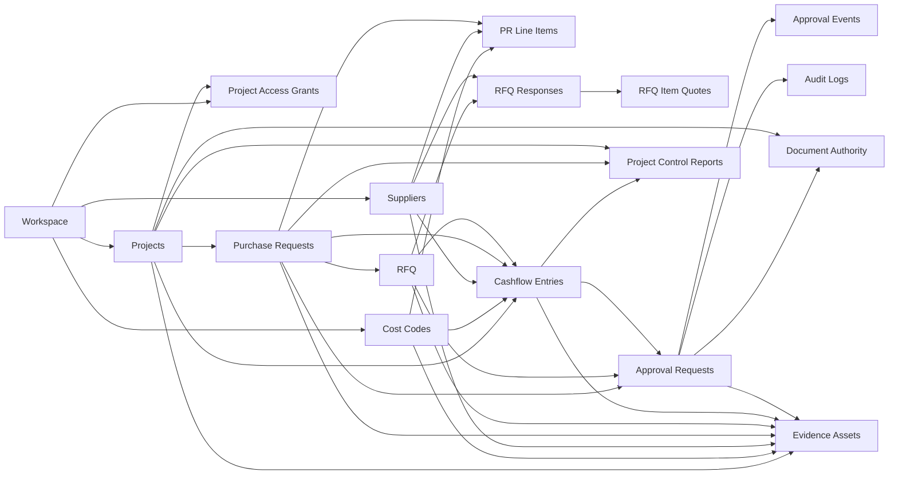

# Buildbybim.space - Implemented ER Diagram

Updated: 2026-05-24  
Status: reflects implemented Supabase migrations `0001`-`0012` and current local-first ERP modules.

For future/conceptual entities, see `docs/PLATFORM_ERD.md`. This document focuses on what is already built or has a migration.

## 1. Current ERP ER Diagram

```mermaid
erDiagram
  AUTH_USERS ||--o{ WORKSPACES : owns
  AUTH_USERS ||--o{ WORKSPACE_MEMBERS : joins
  WORKSPACES ||--o{ WORKSPACE_MEMBERS : has
  WORKSPACE_MEMBERS ||--o{ PROJECT_ACCESS_GRANTS : project_role

  WORKSPACES ||--o{ PROJECTS : owns
  WORKSPACES ||--o{ COST_CODES : owns_custom
  WORKSPACES ||--o{ SUPPLIERS : owns
  PROJECTS ||--o{ PROJECT_ACCESS_GRANTS : scoped_access

  SUPPLIERS ||--o{ SUPPLIER_PRICE_HISTORY : has_prices
  COST_CODES ||--o{ SUPPLIER_PRICE_HISTORY : cost_reference

  PROJECTS ||--o{ PURCHASE_REQUESTS : has_pr
  PURCHASE_REQUESTS ||--o{ PR_LINE_ITEMS : contains
  COST_CODES ||--o{ PR_LINE_ITEMS : classifies
  SUPPLIERS ||--o{ PR_LINE_ITEMS : preferred_supplier

  PURCHASE_REQUESTS ||--o{ RFQS : creates
  PROJECTS ||--o{ RFQS : has_rfq
  RFQS ||--o{ RFQ_RESPONSES : receives
  SUPPLIERS ||--o{ RFQ_RESPONSES : responds
  RFQ_RESPONSES ||--o{ RFQ_ITEM_QUOTES : contains
  PR_LINE_ITEMS ||--o{ RFQ_ITEM_QUOTES : quoted_line
  COST_CODES ||--o{ RFQ_ITEM_QUOTES : cost_reference

  WORKSPACES ||--o{ CASHFLOW_ENTRIES : owns
  PROJECTS ||--o{ CASHFLOW_ENTRIES : ledger
  COST_CODES ||--o{ CASHFLOW_ENTRIES : cost_reference
  SUPPLIERS ||--o{ CASHFLOW_ENTRIES : supplier_reference
  PURCHASE_REQUESTS ||--o{ CASHFLOW_ENTRIES : source_pr
  RFQS ||--o{ CASHFLOW_ENTRIES : source_rfq

  WORKSPACES ||--o{ RECURRING_TEMPLATES : has
  PROJECTS ||--o{ RECURRING_TEMPLATES : schedules
  COST_CODES ||--o{ RECURRING_TEMPLATES : default_cost
  SUPPLIERS ||--o{ RECURRING_TEMPLATES : default_supplier
  RECURRING_TEMPLATES ||--o{ CASHFLOW_ENTRIES : generates

  WORKSPACES ||--|| PROJECT_CONTROL_SETTINGS : configures

  WORKSPACES ||--o{ APPROVAL_REQUESTS : owns
  APPROVAL_REQUESTS ||--o{ APPROVAL_EVENTS : logs
  PURCHASE_REQUESTS ||--o| APPROVAL_REQUESTS : target_pr
  RFQS ||--o| APPROVAL_REQUESTS : target_rfq_award
  CASHFLOW_ENTRIES ||--o| APPROVAL_REQUESTS : target_cashflow
  WORKSPACES ||--o{ DOCUMENT_AUTHORITY : owns_document_stamps
  PROJECTS ||--o{ DOCUMENT_AUTHORITY : document_project
  APPROVAL_REQUESTS ||--o{ DOCUMENT_AUTHORITY : stamps_document

  WORKSPACES ||--o{ EVIDENCE_ASSETS : owns
  EVIDENCE_ASSETS ||--o{ EVIDENCE_LINKS : links
  PROJECTS ||--o{ EVIDENCE_LINKS : target_project
  COST_CODES ||--o{ EVIDENCE_LINKS : target_cost
  SUPPLIERS ||--o{ EVIDENCE_LINKS : target_supplier
  PURCHASE_REQUESTS ||--o{ EVIDENCE_LINKS : target_pr
  RFQS ||--o{ EVIDENCE_LINKS : target_rfq
  CASHFLOW_ENTRIES ||--o{ EVIDENCE_LINKS : target_cashflow
  APPROVAL_REQUESTS ||--o{ EVIDENCE_LINKS : target_approval

  WORKSPACES ||--o{ PLANS : configures
  PLANS ||--o{ APP_ACCESS_RULES : grants
  WORKSPACES ||--o{ APP_ACCESS_OVERRIDES : workspace_override
  WORKSPACE_MEMBERS ||--o{ APP_ACCESS_OVERRIDES : member_override
  AUTH_USERS ||--o{ APP_ACCESS_OVERRIDES : user_override
  WORKSPACES ||--o{ AUDIT_LOGS : records
  AUTH_USERS ||--o{ AUDIT_LOGS : performs
  WORKSPACES ||--o{ KV_STORE : syncs_local_keys

  AUTH_USERS {
    uuid id PK
    string email
  }

  WORKSPACES {
    uuid id PK
    string name
    string slug
    uuid owner_user_id FK
    string status
    timestamptz created_at
    timestamptz updated_at
  }

  WORKSPACE_MEMBERS {
    uuid id PK
    uuid workspace_id FK
    uuid user_id FK
    string role
    string status
    timestamptz joined_at
  }

  PROJECT_ACCESS_GRANTS {
    string id PK
    uuid workspace_id FK
    string project_id
    string member_id
    string member_name
    string role
    string supplier_id
    string[] extra_permissions
    string[] denied_permissions
    boolean active
    string created_by
    timestamptz updated_at
  }

  PROJECTS {
    uuid id PK
    uuid workspace_id FK
    string code
    string name
    uuid client_id
    string client_name
    string customer_type
    numeric contract_value
    numeric planned_cost
    numeric actual_cost
    numeric planned_revenue
    numeric actual_revenue
    date start_date
    date end_date
    string status
  }

  COST_CODES {
    string id PK
    uuid workspace_id FK
    string code
    string parent_code
    string name
    string category
    string default_unit
    numeric default_unit_price
    boolean active
  }

  SUPPLIERS {
    string id PK
    uuid workspace_id FK
    string name
    string short_name
    string type
    string tax_id
    string phone
    string email
    string payment_terms
    int rating
    boolean active
  }

  SUPPLIER_PRICE_HISTORY {
    string id PK
    uuid workspace_id FK
    string supplier_id FK
    string cost_code_id
    string item_description
    numeric unit_price
    numeric quantity
    numeric total_amount
    date quoted_at
    string source_type
    string source_document_id
  }

  PURCHASE_REQUESTS {
    string id PK
    uuid workspace_id FK
    uuid project_id
    string pr_no
    uuid requested_by FK
    uuid approved_by FK
    string status
    date request_date
    date needed_by_date
    numeric total_amount
    string linked_rfq_id
    string linked_po_document_id
  }

  PR_LINE_ITEMS {
    string id PK
    string pr_id FK
    string cost_code_id
    string description
    numeric quantity
    string unit
    numeric estimated_unit_price
    numeric amount
    string preferred_supplier_id
  }

  RFQS {
    string id PK
    uuid workspace_id FK
    uuid project_id
    string pr_id FK
    string rfq_no
    string status
    string[] invited_supplier_ids
    string awarded_supplier_id
    timestamptz awarded_at
    string award_reason
  }

  RFQ_RESPONSES {
    string id PK
    string rfq_id FK
    string supplier_id
    numeric total_amount
    string payment_terms
    date delivery_date
    date valid_until
    string received_via
  }

  RFQ_ITEM_QUOTES {
    string id PK
    string response_id FK
    string pr_line_item_id
    string cost_code_id
    string description
    numeric unit_price
    numeric amount
    boolean available
  }

  CASHFLOW_ENTRIES {
    string id PK
    uuid workspace_id FK
    uuid project_id
    string direction
    string category
    numeric amount
    string description
    date entry_date
    string status
    string cost_code_id
    string supplier_id
    string pr_id
    string rfq_id
    string po_document_id
    string source_type
    string source_document_id
    string recurring_template_id
  }

  RECURRING_TEMPLATES {
    string id PK
    uuid workspace_id FK
    string name
    string direction
    string category
    numeric amount
    uuid project_id
    string cost_code_id
    string supplier_id
    string frequency
    date start_date
    date end_date
    boolean active
  }

  PROJECT_CONTROL_SETTINGS {
    uuid workspace_id PK
    string default_report_type
    jsonb alert_thresholds
    timestamptz updated_at
  }

  APPROVAL_REQUESTS {
    string id PK
    uuid workspace_id FK
    string target_type
    string target_id
    string source_app_id
    string project_id
    string cost_code_id
    string supplier_id
    numeric amount
    string status
    string priority
    string requested_by
    string approver_id
    jsonb metadata
  }

  APPROVAL_EVENTS {
    string id PK
    string approval_request_id FK
    string action
    string actor_id
    string from_status
    string to_status
    string reason
    timestamptz created_at
  }

  DOCUMENT_AUTHORITY {
    string id PK
    uuid workspace_id FK
    string document_id
    string document_no
    string document_type
    string project_id
    string status
    string prepared_by_name
    string submitted_by_name
    string checked_by_name
    string approved_by_name
    string issued_by_name
    string approval_request_id
    string void_reason
    timestamptz updated_at
  }

  EVIDENCE_ASSETS {
    string id PK
    uuid workspace_id FK
    string asset_type
    string status
    string title
    string description
    string file_name
    string mime_type
    bigint file_size
    string storage_path
    string preview_url
    numeric amount
    string currency
    timestamptz captured_at
    timestamptz uploaded_at
    string uploaded_by
    timestamptz verified_at
    string verified_by
    string rejected_reason
    string source_app_id
    string source_document_id
    string[] tags
    jsonb metadata
  }

  EVIDENCE_LINKS {
    string id PK
    uuid workspace_id FK
    string evidence_asset_id FK
    string target_type
    string target_id
    string label
    timestamptz created_at
  }

  PLANS {
    string id PK
    uuid workspace_id FK
    string name
    numeric price_amount
    string currency
    string billing_interval
    string status
  }

  APP_ACCESS_RULES {
    string id PK
    string plan_id FK
    string app_id
    string feature_key
    string access_level
    boolean enabled
    jsonb limits
  }

  APP_ACCESS_OVERRIDES {
    string id PK
    uuid workspace_id FK
    uuid workspace_member_id FK
    uuid user_id FK
    string scope
    string app_id
    string effect
    string access_level
    jsonb limits
  }

  AUDIT_LOGS {
    string id PK
    uuid workspace_id FK
    uuid actor_user_id FK
    string actor_type
    string action
    string target_type
    string target_id
    jsonb payload
    timestamptz created_at
  }

  KV_STORE {
    uuid workspace_id PK
    string key PK
    jsonb value
    timestamptz updated_at
  }
```

## 2. Business Flow View

## 3. Important Notes

- `workspace_id` is the tenant boundary for all business tables.
- Some links are **reference-by-convention** rather than hard SQL FK because local-first IDs are strings while some cloud tables use UUIDs.
- `approval_requests.target_type + target_id` is polymorphic. It can point to PR, RFQ award, cashflow entry, PO document, invoice, or budget override.
- `project_access_grants` is the project-level RBAC layer. App-level access still decides whether a user can enter an app; project grants decide which project data/actions they can use inside that app.
- `document_authority` stores the prepared/submitted/checked/approved/issued stamps for BuildDocs-style documents. It is separated from document content so PDF/print templates can consume approval metadata without owning the workflow.
- `evidence_links.target_type + target_id` is polymorphic. It can point to project, cost code, supplier, PR, RFQ, cashflow entry, document, defect, approval, or other external proof target.
- BuildDocs documents still live in workspace local storage / `kv_store`; PO and invoice approval targets are reserved but not yet fully relational.
- `project_control_settings` is the only persisted Project Control table. Reports are generated from Projects, PR, Suppliers, and Cashflow.
- `audit_logs` is the low-level audit table. `approval_events` is the business timeline per approval request.
- Field-level definitions now live in `docs/DATA_DICTIONARY.md`.
- Business sequence handoff now lives in `docs/WORKFLOW_SEQUENCE.md`.
- Local-first to Supabase mapper rules now live in `docs/SUPABASE_SYNC_CONTRACT.md`.

## 4. Table Source Map

| Migration | Tables |
|---|---|
| `0001_initial_platform.sql` | `workspaces`, `workspace_members`, `plans`, `app_access_rules`, `app_access_overrides`, `audit_logs`, `cashflow_entries` |
| `0002_kv_store.sql` | `kv_store` |
| `0003_projects.sql` | `projects` |
| `0004_cost_codes.sql` | `cost_codes` |
| `0005_suppliers.sql` | `suppliers`, `supplier_price_history` |
| `0006_purchase_requests.sql` | `purchase_requests`, `pr_line_items` |
| `0007_rfqs.sql` | `rfqs`, `rfq_responses`, `rfq_item_quotes` |
| `0008_cashflow_extension.sql` | extends `cashflow_entries`, adds `recurring_templates` |
| `0009_project_control_settings.sql` | `project_control_settings` |
| `0010_approval_requests.sql` | `approval_requests`, `approval_events` |
| `0011_evidence_assets.sql` | `evidence_assets`, `evidence_links` |
| `0012_project_access_document_authority.sql` | `project_access_grants`, `document_authority` |
