# Build By BIM Platform - ER Diagram

Updated: 2026-05-23
Status: Conceptual backend model for future Supabase/Postgres implementation

## 1. Purpose

เอกสารนี้เป็น ER diagram ระดับ platform สำหรับพัฒนา Build By BIM จาก local-first web app ไปสู่ระบบจริงที่รองรับ:

- แอปขายทีละตัวแบบ wedge app
- สมาชิกและ support plan
- workspace/team/customer data
- BOQ, Docs, Defect, Cashflow
- Design brief, moodboard, options, presentation workflow
- Prompt set, prompt template, version, favorite
- Content workflow, post draft, campaign, approval, performance note
- Agent API, LINE intake, OCR/AI workflow
- BIM-ready data layer
- IoT-ready data layer ในอนาคต

นี่ไม่ใช่ schema production สุดท้าย แต่เป็น data boundary กลางเพื่อให้หลาย agent พัฒนาไปในทิศทางเดียวกัน

## 2. Conceptual ER Diagram

```mermaid
erDiagram
  USER ||--o{ WORKSPACE_MEMBER : joins
  WORKSPACE ||--o{ WORKSPACE_MEMBER : has
  WORKSPACE ||--o{ PROJECT : owns
  WORKSPACE ||--o{ CLIENT : manages
  CLIENT ||--o{ PROJECT : hires

  APP ||--o{ APP_FEATURE : exposes
  APP ||--o{ APP_ACCESS_RULE : gated_by
  APP_FEATURE ||--o{ APP_ACCESS_RULE : gated_by
  PLAN ||--o{ APP_ACCESS_RULE : grants
  WORKSPACE ||--o{ APP_ACCESS_OVERRIDE : overrides
  WORKSPACE_MEMBER ||--o{ APP_ACCESS_OVERRIDE : member_overrides
  USER ||--o{ APP_ACCESS_OVERRIDE : user_overrides
  APP ||--o{ APP_ACCESS_OVERRIDE : scoped_to
  APP_FEATURE ||--o{ APP_ACCESS_OVERRIDE : feature_scoped_to
  WORKSPACE ||--o{ SUBSCRIPTION : has
  PLAN ||--o{ SUBSCRIPTION : selected
  SUBSCRIPTION ||--o{ PAYMENT : bills
  WORKSPACE ||--o{ SUPPORT_REQUEST : receives
  USER ||--o{ SUPPORT_REQUEST : creates

  WORKSPACE ||--o{ PROMPT_SET : owns
  USER ||--o{ PROMPT_FAVORITE : favorites
  PROMPT_SET ||--o{ PROMPT_TEMPLATE : contains
  PROMPT_TEMPLATE ||--o{ PROMPT_VERSION : versions
  PROMPT_SET ||--o{ PROMPT_FAVORITE : favorited_set
  PROMPT_TEMPLATE ||--o{ PROMPT_FAVORITE : favorited_template

  WORKSPACE ||--o{ CONTENT_CAMPAIGN : runs
  WORKSPACE ||--o{ CONTENT_WORKFLOW : owns
  CONTENT_CAMPAIGN ||--o{ CONTENT_WORKFLOW : groups
  USER ||--o{ CONTENT_WORKFLOW : starts
  CONTENT_WORKFLOW ||--o{ CONTENT_POST_DRAFT : generates
  PROMPT_TEMPLATE ||--o{ CONTENT_POST_DRAFT : can_generate
  CONTENT_POST_DRAFT ||--o{ CONTENT_APPROVAL : reviewed_by
  CONTENT_POST_DRAFT ||--o{ CONTENT_PERFORMANCE_NOTE : learns_from

  PROJECT ||--o{ TASK : contains
  PROJECT ||--o{ DOCUMENT : contains
  PROJECT ||--o{ DEFECT : tracks
  PROJECT ||--o{ EXPENSE : spends
  PROJECT ||--o{ CASHFLOW_ENTRY : records
  PROJECT ||--o{ DESIGN_BRIEF : starts
  DESIGN_BRIEF ||--o{ DESIGN_REQUIREMENT : defines
  DESIGN_BRIEF ||--o{ DESIGN_OPTION : explores
  DESIGN_BRIEF ||--o{ DESIGN_PLAN_REVIEW : reviewed_by
  DESIGN_OPTION ||--o{ DESIGN_FEEDBACK : receives
  DESIGN_OPTION ||--o{ PRESENTATION_DECK : presents
  DESIGN_OPTION ||--o{ FILE_ASSET : uses
  DESIGN_PLAN_REVIEW ||--o{ DESIGN_PLAN_REVIEW_FINDING : reports
  DESIGN_PLAN_REVIEW ||--o{ DESIGN_PLAN_REVIEW_EXPORT : exports
  DESIGN_PLAN_REVIEW ||--o{ FILE_ASSET : reviews
  DESIGN_REQUIREMENT }o--o| SPACE : becomes
  DOCUMENT ||--o{ DOCUMENT_LINE_ITEM : includes
  BOQ_ITEM ||--o{ DOCUMENT_LINE_ITEM : referenced_by
  TASK ||--o{ BOQ_ALLOCATION : consumes
  BOQ_ITEM ||--o{ BOQ_ALLOCATION : allocated_to

  WORKSPACE ||--o{ FILE_ASSET : stores
  PROJECT ||--o{ FILE_ASSET : attaches
  DOCUMENT ||--o{ FILE_ASSET : attaches
  DEFECT ||--o{ FILE_ASSET : has_photos

  PROJECT ||--o{ BIM_MODEL : has
  BIM_MODEL ||--o{ BIM_MODEL_VERSION : versions
  BIM_MODEL_VERSION ||--o{ BIM_ELEMENT : contains
  PROJECT ||--o{ SPACE : defines
  PROJECT ||--o{ ZONE : defines
  ZONE ||--o{ SPACE : groups
  BIM_ELEMENT }o--o| SPACE : located_in
  BIM_ELEMENT }o--o| ZONE : belongs_to
  BIM_ELEMENT ||--o{ DEFECT : may_have
  BIM_ELEMENT ||--o{ BOQ_ALLOCATION : may_drive

  SPACE ||--o{ DEVICE : hosts
  BIM_ELEMENT ||--o{ DEVICE : linked_to
  DEVICE ||--o{ TELEMETRY_POINT : exposes
  TELEMETRY_POINT ||--o{ TELEMETRY_READING : records
  DEVICE ||--o{ ALERT : triggers
  ALERT_RULE ||--o{ ALERT : creates
  ALERT ||--o{ MAINTENANCE_TASK : opens
  PROJECT ||--o{ MAINTENANCE_TASK : schedules

  USER ||--o{ LINE_ACCOUNT : connects
  WORKSPACE ||--o{ AGENT_RUN : scopes
  USER ||--o{ AGENT_RUN : starts
  AGENT_RUN ||--o{ AGENT_MESSAGE : includes
  AGENT_RUN ||--o{ AGENT_TOOL_CALL : calls
  AGENT_RUN ||--o{ AGENT_ACTION : proposes
  AGENT_INBOX_ITEM ||--o{ FILE_ASSET : stores
  AGENT_INBOX_ITEM }o--o| AGENT_RUN : processed_by
  FILE_ASSET ||--o{ RECEIPT_EXTRACTION : parsed_as
  RECEIPT_EXTRACTION }o--o| EXPENSE : commits_to
  AGENT_ACTION ||--o{ AUDIT_LOG : writes
  USER ||--o{ AUDIT_LOG : performs

  USER {
    uuid id PK
    string email
    string display_name
    string status
    datetime created_at
  }

  WORKSPACE {
    uuid id PK
    string name
    string slug
    string owner_user_id FK
    string status
    datetime created_at
  }

  WORKSPACE_MEMBER {
    uuid id PK
    uuid workspace_id FK
    uuid user_id FK
    string role
    string status
    datetime joined_at
  }

  APP {
    string id PK
    string name
    string category
    string profession_tag
    string status
    string default_access_level
  }

  APP_FEATURE {
    uuid id PK
    string app_id FK
    string feature_key
    string name
    string status
    json default_limits
  }

  PLAN {
    uuid id PK
    string name
    number price_amount
    string billing_interval
    int support_quota
    json billing_note
    string status
  }

  APP_ACCESS_RULE {
    uuid id PK
    uuid plan_id FK
    string app_id FK
    uuid app_feature_id FK
    string access_level
    bool enabled
    json limits
    int priority
    datetime starts_at
    datetime ends_at
  }

  APP_ACCESS_OVERRIDE {
    uuid id PK
    uuid workspace_id FK
    uuid workspace_member_id FK
    uuid user_id FK
    string app_id FK
    uuid app_feature_id FK
    string effect
    string access_level
    json limits
    string reason
    uuid created_by FK
    datetime starts_at
    datetime ends_at
  }

  SUBSCRIPTION {
    uuid id PK
    uuid workspace_id FK
    uuid plan_id FK
    string provider
    string provider_ref
    string status
    datetime current_period_end
  }

  PAYMENT {
    uuid id PK
    uuid subscription_id FK
    number amount
    string currency
    string provider
    string status
    datetime paid_at
  }

  SUPPORT_REQUEST {
    uuid id PK
    uuid workspace_id FK
    uuid created_by FK
    string subject
    string channel
    string priority
    string status
  }

  PROMPT_SET {
    uuid id PK
    uuid workspace_id FK
    uuid owner_user_id FK
    string title
    string category
    string profession_tag
    string visibility
    string access_level
    string status
    datetime created_at
  }

  PROMPT_TEMPLATE {
    uuid id PK
    uuid prompt_set_id FK
    string app_id FK
    string title
    string template_type
    text prompt_body
    json variables
    string risk_level
    string status
  }

  PROMPT_VERSION {
    uuid id PK
    uuid prompt_template_id FK
    int version_number
    text prompt_body
    json variables
    uuid created_by FK
    string change_note
    datetime created_at
  }

  PROMPT_FAVORITE {
    uuid id PK
    uuid user_id FK
    uuid prompt_set_id FK
    uuid prompt_template_id FK
    datetime favorited_at
  }

  CONTENT_CAMPAIGN {
    uuid id PK
    uuid workspace_id FK
    string name
    string channel
    string goal
    string status
    date start_date
    date end_date
  }

  CONTENT_WORKFLOW {
    uuid id PK
    uuid workspace_id FK
    uuid campaign_id FK
    uuid created_by FK
    string workflow_type
    string source_type
    text topic
    string status
    json input_payload
    datetime created_at
  }

  CONTENT_POST_DRAFT {
    uuid id PK
    uuid content_workflow_id FK
    uuid prompt_template_id FK
    string channel
    string hook
    text caption
    string cta
    json hashtags
    text image_prompt
    string approval_status
  }

  CONTENT_APPROVAL {
    uuid id PK
    uuid content_post_draft_id FK
    uuid reviewer_id FK
    string decision
    text note
    datetime decided_at
  }

  CONTENT_PERFORMANCE_NOTE {
    uuid id PK
    uuid content_post_draft_id FK
    string metric_source
    json metrics
    text lesson
    datetime recorded_at
  }

  CLIENT {
    uuid id PK
    uuid workspace_id FK
    string name
    string phone
    string email
    string type
  }

  PROJECT {
    uuid id PK
    uuid workspace_id FK
    uuid client_id FK
    string name
    string project_type
    string status
    datetime start_date
  }

  TASK {
    uuid id PK
    uuid project_id FK
    string name
    string status
    date due_date
    uuid assignee_id FK
  }

  DOCUMENT {
    uuid id PK
    uuid project_id FK
    uuid client_id FK
    string document_type
    string title
    string status
    number total_amount
  }

  DOCUMENT_LINE_ITEM {
    uuid id PK
    uuid document_id FK
    uuid boq_item_id FK
    string description
    number quantity
    number unit_price
  }

  BOQ_ITEM {
    uuid id PK
    uuid workspace_id FK
    string code
    string keynote
    string description
    string unit
    number unit_cost
  }

  BOQ_ALLOCATION {
    uuid id PK
    uuid task_id FK
    uuid boq_item_id FK
    uuid bim_element_id FK
    number allocated_amount
    datetime updated_at
  }

  DEFECT {
    uuid id PK
    uuid project_id FK
    uuid bim_element_id FK
    uuid space_id FK
    string severity
    string status
    string owner
    date due_date
  }

  EXPENSE {
    uuid id PK
    uuid project_id FK
    string category
    string merchant
    number amount
    date expense_date
    string source
  }

  CASHFLOW_ENTRY {
    uuid id PK
    uuid project_id FK
    string direction
    string category
    number amount
    date entry_date
    uuid source_expense_id FK
  }

  DESIGN_BRIEF {
    uuid id PK
    uuid project_id FK
    string project_type
    string style_preference
    number budget_min
    number budget_max
    string status
  }

  DESIGN_REQUIREMENT {
    uuid id PK
    uuid design_brief_id FK
    string requirement_type
    string name
    number target_area
    string note
  }

  DESIGN_OPTION {
    uuid id PK
    uuid design_brief_id FK
    string name
    string concept_summary
    string prompt_version
    string status
  }

  DESIGN_PLAN_REVIEW {
    uuid id PK
    uuid project_id FK
    uuid design_brief_id FK
    string title
    string status
    number feasibility_score
    datetime reviewed_at
  }

  DESIGN_PLAN_REVIEW_FINDING {
    uuid id PK
    uuid review_id FK
    string layer
    string severity
    string title
    text note
    text action
    number confidence
  }

  DESIGN_PLAN_REVIEW_EXPORT {
    uuid id PK
    uuid review_id FK
    uuid file_asset_id FK
    string export_type
    string status
    datetime exported_at
  }

  DESIGN_FEEDBACK {
    uuid id PK
    uuid design_option_id FK
    uuid created_by FK
    string feedback_type
    text note
    datetime created_at
  }

  PRESENTATION_DECK {
    uuid id PK
    uuid design_option_id FK
    string title
    string status
    datetime exported_at
  }

  FILE_ASSET {
    uuid id PK
    uuid workspace_id FK
    string owner_type
    uuid owner_id
    string bucket
    string path
    string mime_type
  }

  BIM_MODEL {
    uuid id PK
    uuid project_id FK
    string name
    string source_type
    string status
  }

  BIM_MODEL_VERSION {
    uuid id PK
    uuid bim_model_id FK
    string version_label
    string source_file_id FK
    datetime imported_at
  }

  BIM_ELEMENT {
    uuid id PK
    uuid model_version_id FK
    string external_id
    string ifc_global_id
    string category
    string family_type
    string level_name
  }

  SPACE {
    uuid id PK
    uuid project_id FK
    uuid zone_id FK
    string name
    string number
    string level_name
  }

  ZONE {
    uuid id PK
    uuid project_id FK
    string name
    string zone_type
  }

  DEVICE {
    uuid id PK
    uuid workspace_id FK
    uuid project_id FK
    uuid space_id FK
    uuid bim_element_id FK
    string device_type
    string status
  }

  TELEMETRY_POINT {
    uuid id PK
    uuid device_id FK
    string metric
    string unit
    string source_key
  }

  TELEMETRY_READING {
    uuid id PK
    uuid telemetry_point_id FK
    number value
    datetime recorded_at
    string quality
  }

  ALERT_RULE {
    uuid id PK
    uuid workspace_id FK
    string metric
    string condition
    number threshold
    string status
  }

  ALERT {
    uuid id PK
    uuid device_id FK
    uuid alert_rule_id FK
    string severity
    string status
    datetime triggered_at
  }

  MAINTENANCE_TASK {
    uuid id PK
    uuid project_id FK
    uuid alert_id FK
    string title
    string status
    date due_date
  }

  LINE_ACCOUNT {
    uuid id PK
    uuid user_id FK
    string line_user_id
    string display_name
    datetime linked_at
  }

  AGENT_INBOX_ITEM {
    uuid id PK
    uuid workspace_id FK
    string channel
    string external_message_id
    string item_type
    string status
  }

  AGENT_RUN {
    uuid id PK
    uuid workspace_id FK
    uuid user_id FK
    string channel
    string status
    datetime started_at
  }

  AGENT_MESSAGE {
    uuid id PK
    uuid agent_run_id FK
    string role
    text content
    datetime created_at
  }

  AGENT_TOOL_CALL {
    uuid id PK
    uuid agent_run_id FK
    string tool_name
    json input
    json output
    string status
  }

  AGENT_ACTION {
    uuid id PK
    uuid agent_run_id FK
    string action_type
    string target_type
    uuid target_id
    string status
  }

  RECEIPT_EXTRACTION {
    uuid id PK
    uuid file_asset_id FK
    uuid agent_run_id FK
    string merchant
    number total_amount
    number confidence
    string status
  }

  AUDIT_LOG {
    uuid id PK
    uuid workspace_id FK
    uuid actor_user_id FK
    string actor_type
    string action
    string target_type
    uuid target_id
    datetime created_at
  }
```

## 3. Implementation Notes

- `WORKSPACE` เป็น tenant boundary หลัก ทุกตาราง business data ต้องอ้าง workspace หรือ project ที่โยงกลับ workspace ได้
- `APP`, `APP_FEATURE`, `PLAN`, `APP_ACCESS_RULE`, `APP_ACCESS_OVERRIDE` ใช้ควบคุม free/paid app access, feature access, support tier และ admin override แบบอิสระ
- `PROMPT_SET`, `PROMPT_TEMPLATE`, `PROMPT_VERSION`, `PROMPT_FAVORITE` คือ product asset layer สำหรับ prompt packs, prompt tools, access tier, versioning และ favorite
- `CONTENT_CAMPAIGN`, `CONTENT_WORKFLOW`, `CONTENT_POST_DRAFT`, `CONTENT_APPROVAL`, `CONTENT_PERFORMANCE_NOTE` คือ draft-first content workflow layer สำหรับสร้างโพสต์/แคมเปญและเรียนรู้จากผลลัพธ์
- `PROJECT`, `CLIENT`, `TASK`, `DOCUMENT`, `BOQ_ITEM`, `DEFECT`, `EXPENSE`, `CASHFLOW_ENTRY` คือ core business workflow
- `DESIGN_BRIEF`, `DESIGN_REQUIREMENT`, `DESIGN_OPTION`, `DESIGN_PLAN_REVIEW`, `DESIGN_PLAN_REVIEW_FINDING`, `DESIGN_PLAN_REVIEW_EXPORT`, `DESIGN_FEEDBACK`, `PRESENTATION_DECK` คือ architect-led design workflow ที่ส่งต่อไป BIM/BOQ/Docs ได้
- `BIM_MODEL`, `BIM_MODEL_VERSION`, `BIM_ELEMENT`, `SPACE`, `ZONE` คือ BIM-ready layer เริ่มจาก import schedule/CSV/IFC metadata ก่อน
- `DEVICE`, `TELEMETRY_POINT`, `TELEMETRY_READING`, `ALERT`, `MAINTENANCE_TASK` คือ IoT-ready layer ในอนาคต
- `AGENT_*`, `LINE_ACCOUNT`, `RECEIPT_EXTRACTION`, `AUDIT_LOG` คือ Agent API/LINE automation layer

## 4. First Production Schema Cut

รอบแรกไม่ควรสร้างทุกตารางพร้อมกัน ให้เริ่มเฉพาะ:

- `users`
- `workspaces`
- `workspace_members`
- `apps`
- `app_features`
- `plans`
- `app_access_rules`
- `app_access_overrides`
- `prompt_sets`
- `prompt_templates`
- `prompt_versions`
- `prompt_favorites`
- `content_campaigns`
- `content_workflows`
- `content_post_drafts`
- `content_approvals`
- `content_performance_notes`
- `projects`
- `clients`
- `design_briefs`
- `design_requirements`
- `design_options`
- `design_plan_reviews`
- `design_plan_review_findings`
- `design_plan_review_exports`
- `documents`
- `document_line_items`
- `boq_items`
- `tasks`
- `boq_allocations`
- `files`
- `audit_logs`

หลังจาก wedge app มีผู้ใช้จริง ค่อยเพิ่ม:

- payment/subscription
- support request
- agent/LINE intake
- BIM link layer
- IoT layer
