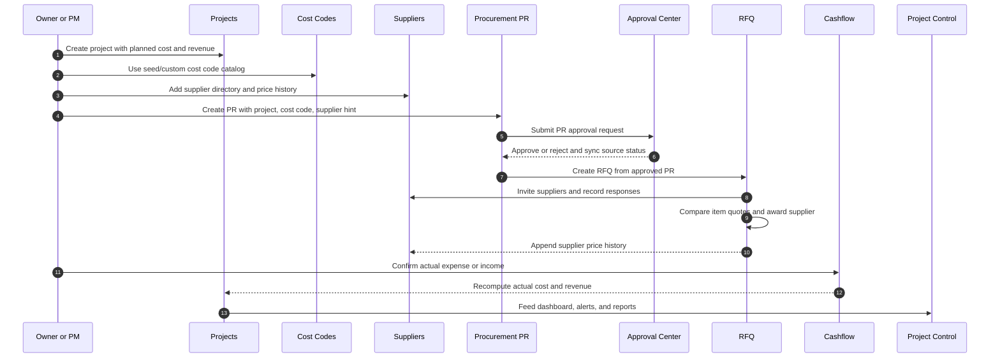
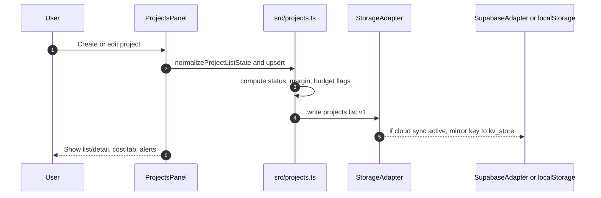
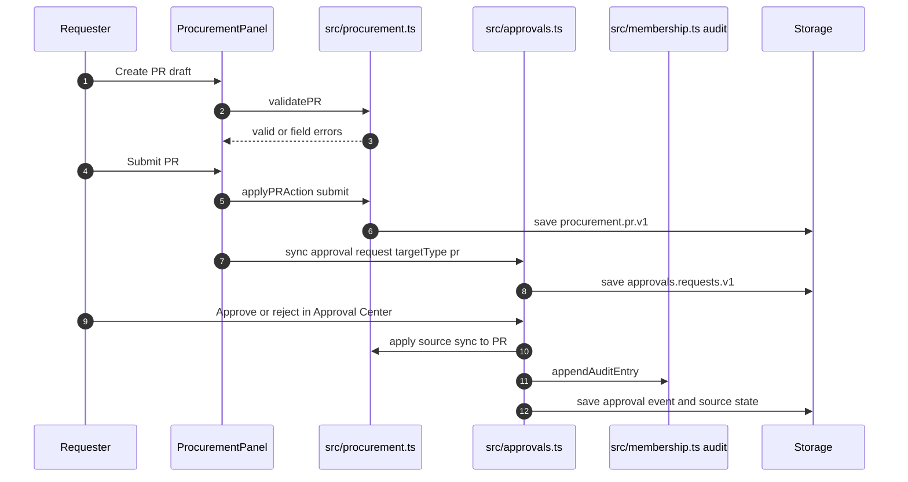
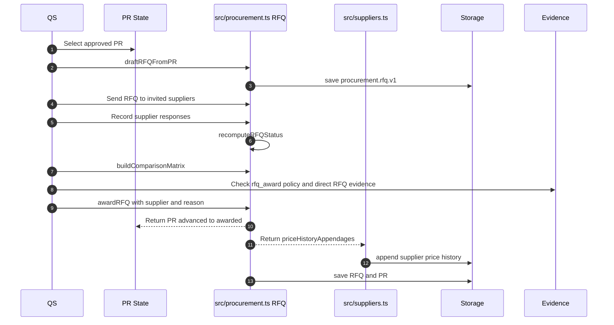
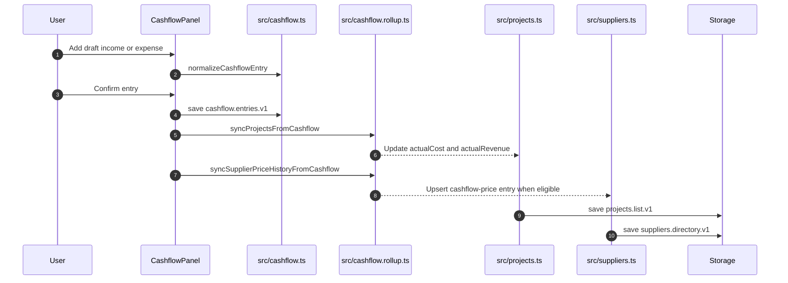
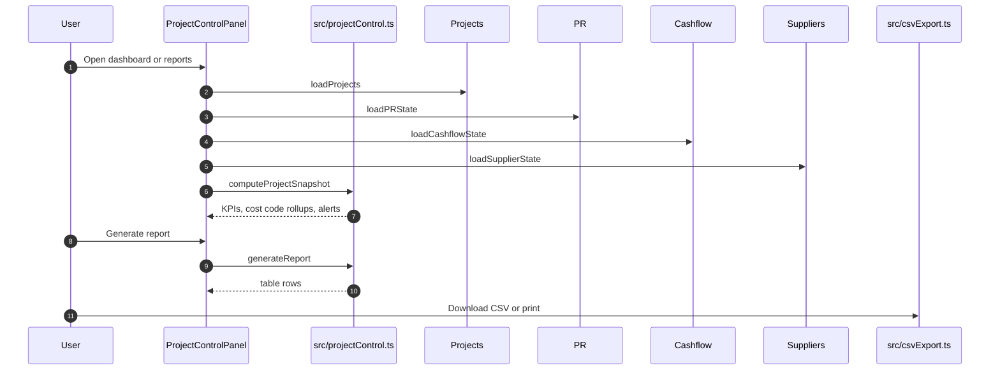
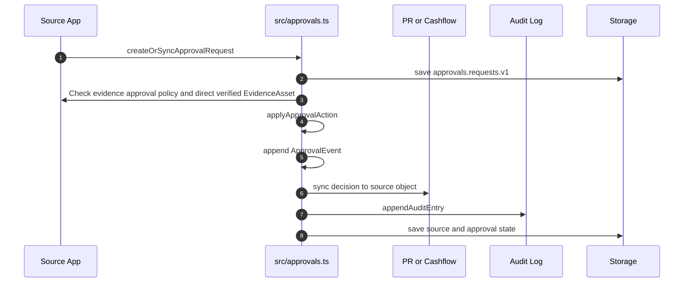
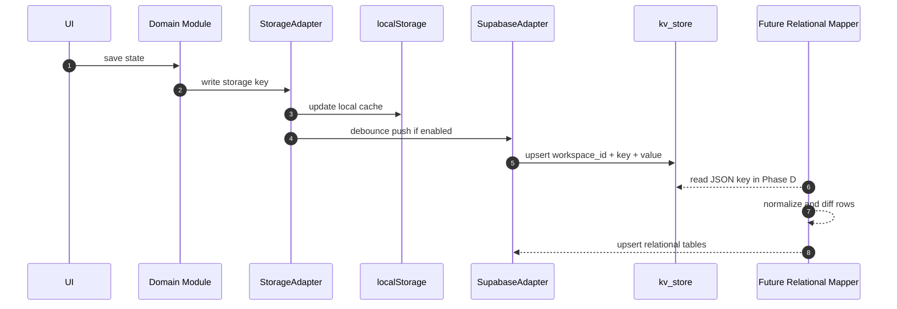
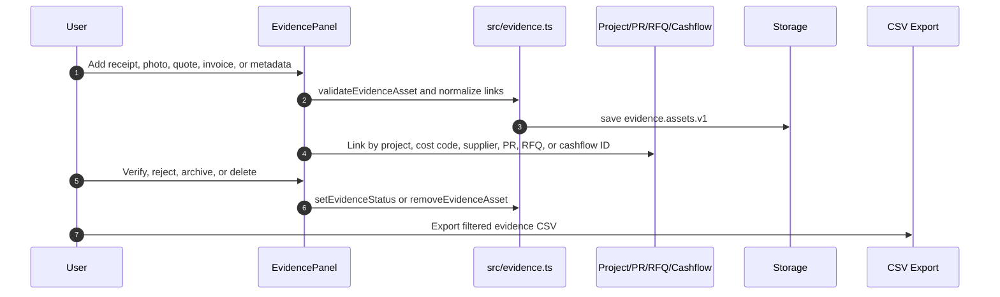

# Buildbybim.space - Workflow Sequence Reference

Updated: 2026-05-24

Status: implementation handoff for the current ERP loop. This document describes what is already built and what each next module should preserve.

Use this with:

- `docs/IMPLEMENTED_ERD.md` for entities.
- `docs/DATA_DICTIONARY.md` for fields and enums.
- `docs/SUPABASE_SYNC_CONTRACT.md` for sync and mapper rules.

## 1. Current ERP Loop

This is the first complete project-cost control loop:

Outcome: the user can see project budget, committed cost, actual cost, paid revenue, margin, stale PRs, and supplier spend from one flow.

## 2. Project Setup Flow

Rules:

- `code` should be unique per workspace.
- `plannedCost` and `plannedRevenue` are user inputs.
- `actualCost` and `actualRevenue` should be recomputed from confirmed cashflow where possible.
- Status can be user-set, but delayed indicators should be derived from dates and budget state in reports.

## 3. Purchase Request Approval Flow

Acceptance rules:

- PR cannot submit without `projectId` and at least one valid line item.
- Only `submitted` PR should be actionable in the approval inbox.
- Approve maps PR to `approved`.
- Reject maps PR to `rejected` and requires a reason.
- Every decision must append `ApprovalEvent`.
- Source sync should write an audit entry because it changes business state.

## 4. RFQ Compare and Award Flow

Acceptance rules:

- RFQ should start only from approved PR.
- Response can be recorded only for invited suppliers.
- Award requires supplier, matching PR, response present, and reason.
- Award also checks `evidence.approval-policy.v1`; default blocks high-value RFQ awards without direct verified evidence linked to the RFQ.
- Award updates RFQ, advances PR, and appends supplier price history.

## 5. Cashflow and Project Actuals Flow

Rules:

- Only `confirmed` entries affect actual project totals.
- `draft` entries remain forecast or pending review.
- `void` entries should not affect rollups.
- Expense with `supplierId + costCodeId` can produce supplier price history.
- Income should update project revenue, not supplier price history.

## 6. Project Control Reporting Flow

Reports implemented:

- `project_pl`
- `cashflow_forecast`
- `cost_variance`
- `supplier_spend`
- `pr_aging`

Project Control is read-only except `project-control.settings.v1`.

## 7. Approval Center Sync Flow

Important distinction:

- `approval_events` is the timeline inside an approval request.
- `audit_logs` is the workspace-level audit trail for governance and admin review.
- Evidence gate is active in Approval Center and Procurement RFQ award: `off | warn | block` can be configured by minimum amount and target type. Default blocks PR, RFQ award, and Cashflow decisions at or above 50,000 THB when no direct verified evidence is linked to the source transaction.

## 8. Supabase Cloud Sync Flow

Current truth: cloud sync is key-level JSON in `kv_store`.

Future truth: relational mappers should populate high-value tables while keeping local-first cache for offline and fast UI.

## 9. Required Audit Points

Add audit events for:

1. Approval decisions that mutate source status.
2. Import operations that create or update many records.
3. Delete or archive actions.
4. Cloud pull that overwrites local data.
5. Payment/subscription/app access changes.
6. Agent actions that create, approve, export, send, or delete data.

## 10. Evidence Asset Flow

Evidence Asset Layer is now implemented as `/evidence`. It links real-world proof to the existing ERP loop.

This fills the main ERP gap before deeper accounting: every cost, quote, payment, defect, and invoice can have evidence.

Current workflow rule: Approval Center and RFQ award can now hard-block covered decisions without direct verified evidence. Next step is to persist evidence policy relationally and add project/app/role dimensions.
